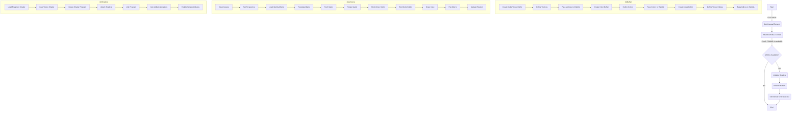

```mermaid
graph TD;
    A[Start] -->|Get Canvas| B(Get Canvas Element)
    B --> C(Initialize WebGL Context)
    C -->|Check if WebGL is available| D{WebGL Available?}
    D -- Yes --> E(Initialize Shaders)
    D -- No --> Z[End]
    E --> F(Initialize Buffers)
    F --> G(Set Interval for drawScene)
    G --> Z

    subgraph initBuffers
        IB1[Create Cube Vertex Buffer] --> IB2[Define Vertices]
        IB2 --> IB3[Pass Vertices to WebGL]
        IB3 --> IB4[Create Color Buffer]
        IB4 --> IB5[Define Colors]
        IB5 --> IB6[Pass Colors to WebGL]
        IB6 --> IB7[Create Index Buffer]
        IB7 --> IB8[Define Vertex Indices]
        IB8 --> IB9[Pass Indices to WebGL]
    end

    subgraph drawScene
        DS1[Clear Canvas] --> DS2[Set Perspective]
        DS2 --> DS3[Load Identity Matrix]
        DS3 --> DS4[Translate Matrix]
        DS4 --> DS5[Push Matrix]
        DS5 --> DS6[Rotate Matrix]
        DS6 --> DS7[Bind Vertex Buffer]
        DS7 --> DS8[Bind Color Buffer]
        DS8 --> DS9[Draw Cube]
        DS9 --> DS10[Pop Matrix]
        DS10 --> DS11[Update Rotation]
    end

    subgraph initShaders
        IS1[Load Fragment Shader] --> IS2[Load Vertex Shader]
        IS2 --> IS3[Create Shader Program]
        IS3 --> IS4[Attach Shaders]
        IS4 --> IS5[Link Program]
        IS5 --> IS6[Get Attribute Locations]
        IS6 --> IS7[Enable Vertex Attributes]
    end
```